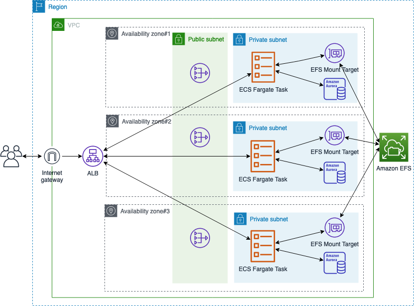

## drupal-on-ecs-using-efs

This repo contains the Cloudformation(CFN) template to deploy the drupal application on AWS ECS Fargate cluster using AWS Elastic File-System (EFS) in a new VPC. 

## Architecture diagram

The following resources are created by the CFN template. 

- A virtual private cloud (VPC) that is configured across three Availability Zones. In each Availability Zone, it creates the public and private subnet.

- A ECS Fargate cluster with container insight enabled for cluster performance monitoring.

- In the public subnets, Internet Gateway (IGW) is created for the application access through ALB and NAT-GW for ECS task to download the image.

- An ECS fargate task in a private subnet, and ECS service to maintain the desired number of tasks running at all times. 

- A EFS file-system and EFS access point for each shared directory for Drupal application.

- An Aurora MySQL compatible serverless DB in each private subnet.





## Deploying the CloudFormation Stacks

Clone the repository and deploy the solution from an AWS Cloudformation console using the cloned main.yaml file.
```
git clone https://github.com/aws-samples/drupal-on-ecs-fargate
```


## Cleanup:

Delete the deployed CFN stack from an AWS Cloudformation console to delete all the resources created by the stack. 


## Security

See [CONTRIBUTING](CONTRIBUTING.md#security-issue-notifications) for more information.


## License

This library is licensed under the MIT-0 License. See the LICENSE file.
